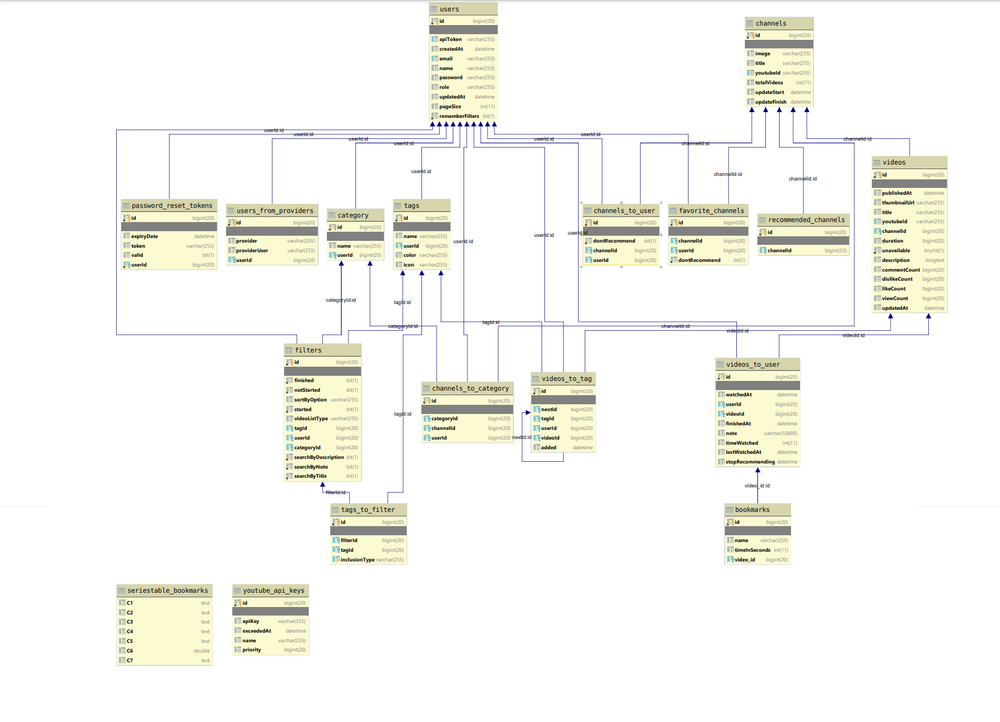
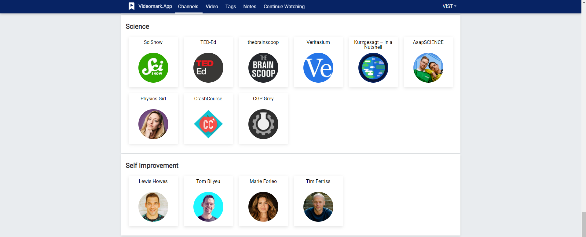
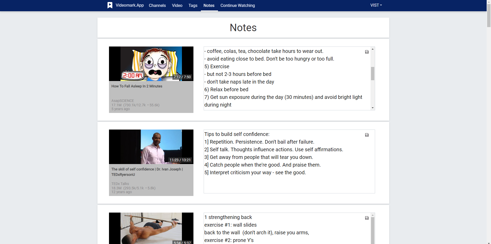
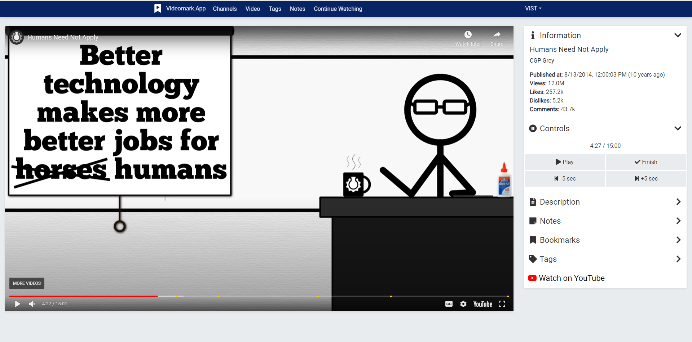

# seriestable

Seriestable is a web appliction that enhances watching youtube videos.

It allows:

* Taking notes when watching video
* Marking videos as watched, ensuring that all the videos in the channels were seen.
* Tracking how much user watched already, how many videos are remaining.

The project consists of spring backend and react frontend.

## Database structure

## App screenshots

### Dashboard

### Notes

### Video

